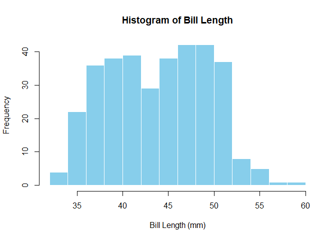
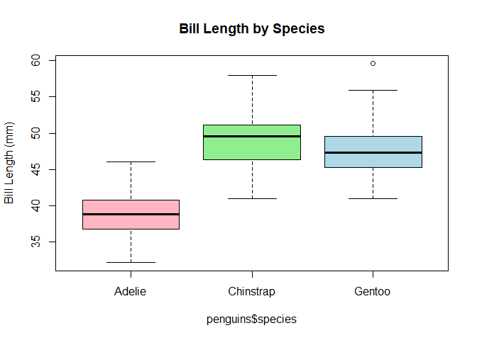

Module 2 — Data & Penguins
================

<!-- Dropdown for modules -->

<select id="module-select" class="course-dropdown" onchange="if (this.value) window.location.href=this.value;">
<option value="">Jump to a module…</option>
<option value="/r_for_nervous_humans/intro_stats/module-1/">1. Getting
Started</option>
<option value="/r_for_nervous_humans/intro_stats/module-3/">3.
Visualisation</option>
<option value="/r_for_nervous_humans/intro_stats/module-4/">4.
Descriptive Statistics</option>
<option value="/r_for_nervous_humans/intro_stats/module-5/">5. Are These
Groups Different?</option>
<option value="/r_for_nervous_humans/intro_stats/module-6/">6. Working
with Categories</option>
<option value="/r_for_nervous_humans/intro_stats/module-7/">7. When Data
Gets Weird</option>
<option value="/r_for_nervous_humans/intro_stats/module-8/">8.
Relationships Between Variables</option>
<option value="/r_for_nervous_humans/intro_stats/module-9/">9. Linear
Regression</option> </select>

### Welcome to Module 2

Now that you know how to run R and store values in variables, it’s time
to look at **real data**. We’ll use the **Palmer Penguins dataset**, a
simple but rich dataset of penguin measurements.

By the end of this module, you will be able to:

- Load a dataset into R  
- Examine its structure  
- Look at basic summaries of the data  
- Make a simple plot

------------------------------------------------------------------------

### Loading the data

The dataset comes from the `palmerpenguins` package. First, install the
package and then load it. You only need to install a package on a
particular machine once so don’t feel the need to run the installation
line every time you want to use a package:

``` r
# Install if you haven't already
install.packages("palmerpenguins")

# Load the package
library(palmerpenguins)

# Load the dataset
data("penguins")
```

You’ll notice that some lines have a hashtag at their start. Hashtags
mean ‘don’t run this line’. They’re an essential tool in keeping track
of what you’re doing and why you’re doing it. Future you will thank
you - trust me. Annotating your code in this way also supports
reproducibility if you share it with someone else. There’s nothing worse
(for a given value of ‘nothing’) than being sent unformatted,
non-annotated code. I once stepped on a slug, bare foot, and
unformatted, non-annotated code is worse.

Note: Running *library(palmerpenguins)* makes the dataset available in
your environment. We use the same argument to load any package.

------------------------------------------------------------------------

### Exploring the dataset

It is important to check any opened data before you use it so that you
can understand its structure and, potentially, identify any issues.
Start by taking a look at the first few rows:

``` r
head(penguins)
```

    ## # A tibble: 6 × 8
    ##   species island    bill_length_mm bill_depth_mm flipper_length_mm body_mass_g sex     year
    ##   <fct>   <fct>              <dbl>         <dbl>             <int>       <int> <fct>  <int>
    ## 1 Adelie  Torgersen           39.1          18.7               181        3750 male    2007
    ## 2 Adelie  Torgersen           39.5          17.4               186        3800 female  2007
    ## 3 Adelie  Torgersen           40.3          18                 195        3250 female  2007
    ## 4 Adelie  Torgersen           NA            NA                  NA          NA <NA>    2007
    ## 5 Adelie  Torgersen           36.7          19.3               193        3450 female  2007
    ## 6 Adelie  Torgersen           39.3          20.6               190        3650 male    2007

Does this look right? Now look at the structure:

``` r
str(penguins)
```

    ## tibble [344 × 8] (S3: tbl_df/tbl/data.frame)
    ##  $ species          : Factor w/ 3 levels "Adelie","Chinstrap",..: 1 1 1 1 1 1 1 1 1 1 ...
    ##  $ island           : Factor w/ 3 levels "Biscoe","Dream",..: 3 3 3 3 3 3 3 3 3 3 ...
    ##  $ bill_length_mm   : num [1:344] 39.1 39.5 40.3 NA 36.7 39.3 38.9 39.2 34.1 42 ...
    ##  $ bill_depth_mm    : num [1:344] 18.7 17.4 18 NA 19.3 20.6 17.8 19.6 18.1 20.2 ...
    ##  $ flipper_length_mm: int [1:344] 181 186 195 NA 193 190 181 195 193 190 ...
    ##  $ body_mass_g      : int [1:344] 3750 3800 3250 NA 3450 3650 3625 4675 3475 4250 ...
    ##  $ sex              : Factor w/ 2 levels "female","male": 2 1 1 NA 1 2 1 2 NA NA ...
    ##  $ year             : int [1:344] 2007 2007 2007 2007 2007 2007 2007 2007 2007 2007 ...

A word followed by parentheses (curved brackets) is a function. It means
‘take the thing inside the brackets and do something to it’. The
‘something’ in question will differ depending on the, well, function of
the function. Here, `str()` tells you the type of each column (numeric,
factor, etc.). This is crucial for understanding what kind of analysis
you can do. Above, `head()` allows us to look at the top five rows of
our data.

We should also summarise our data:

``` r
summary(penguins)
```

    ##       species          island    bill_length_mm  bill_depth_mm   flipper_length_mm  body_mass_g  
    ##  Adelie   :152   Biscoe   :168   Min.   :32.10   Min.   :13.10   Min.   :172.0     Min.   :2700  
    ##  Chinstrap: 68   Dream    :124   1st Qu.:39.23   1st Qu.:15.60   1st Qu.:190.0     1st Qu.:3550  
    ##  Gentoo   :124   Torgersen: 52   Median :44.45   Median :17.30   Median :197.0     Median :4050  
    ##                                  Mean   :43.92   Mean   :17.15   Mean   :200.9     Mean   :4202  
    ##                                  3rd Qu.:48.50   3rd Qu.:18.70   3rd Qu.:213.0     3rd Qu.:4750  
    ##                                  Max.   :59.60   Max.   :21.50   Max.   :231.0     Max.   :6300  
    ##                                  NA's   :2       NA's   :2       NA's   :2         NA's   :2     
    ##      sex           year     
    ##  female:165   Min.   :2007  
    ##  male  :168   1st Qu.:2007  
    ##  NA's  : 11   Median :2008  
    ##               Mean   :2008  
    ##               3rd Qu.:2009  
    ##               Max.   :2009  
    ## 

The `summary()` function gives you min, max, mean and other values for
numeric columns. It shows counts for categorical columns like species
and sex. This provides a quick way to get to know your dataset.

------------------------------------------------------------------------

### Data classes

Every column in a dataset has a **class** hat describes the kind of data
it holds. Understanding the class helps R know what operations you can
do with those data.

Common classes:

- `numeric` – numbers you can calculate with  
- `integer` – whole numbers  
- `factor` – categorical variables like species or sex  
- `character` – text  
- `logical` – TRUE/FALSE

Check the class of each column in `penguins`:

``` r
# Check classes of all columns
sapply(penguins, class)
```

    ##           species            island    bill_length_mm     bill_depth_mm flipper_length_mm 
    ##          "factor"          "factor"         "numeric"         "numeric"         "integer" 
    ##       body_mass_g               sex              year 
    ##         "integer"          "factor"         "integer"

Notice that `species` and `sex` are factors (categories), while
`bill_length_mm` and `body_mass_g` are numeric.This determines what
kinds of calculations or plots you can do later.

------------------------------------------------------------------------

### Visualising variables

Let’s plot bill length to look at the distribution:

``` r
hist(penguins$bill_length_mm, 
     main = "Histogram of Bill Length", 
     xlab = "Bill Length (mm)", 
     col = "skyblue", 
     border = "white")
```

If you run this code you’ll find that it doesn’t work. Why might this
be? Take a look at your data (double-click *penguins* in your
Environment, look at the structure and summary) and see if you can spot
any potential issues.

The keen-eyed among you will notice that the `bill_length_mm` variable
has cells that contain NA values. NA is not the same as 0. A value of 0
means that the would have been a bill length of 0 mm (hopefully no
penguins were sans bill) whereas as an NA value indicates the complete
absence of data.

It might be tempting to just remove all rows with missing values
straight away. But that can quietly throw away a lot of useful data,
especially if only one variable is missing.

Instead, we’ll take a more careful approach and deal with missing values
*only when we need to*.

A useful way to think about it: \* If you’re working with **one
variable** → remove `NA`s from that variable only  
\* If you’re comparing **two or more variables** → remove rows where
those specific variables are missing

This way, we keep as much data as possible while still making sure our
plots and calculations work properly.

You can also check for missing values using:

``` r
sum(is.na(penguins$bill_length_mm))
```

    ## [1] 2

Many R functions do not know how to handle an absence of data without
our instruction. We can do this a number of ways but for now we’ll use
`na.omit` and save the new, NA-free variable, for plotting.

``` r
bill_length <- na.omit(penguins$bill_length_mm)

hist(bill_length, 
     main = "Histogram of Bill Length", 
     xlab = "Bill Length (mm)", 
     col = "skyblue", 
     border = "white")
```

<!-- -->

Note: Putting `?` or `??` before a function name will search your
installed packages for any help documentation on that particular
function. You can use `?hist` to see more options for histograms, for
example. Help files include descriptions of all arguments used in the
function, as well as examples of the function in use.

We can also see how bill length varies by species:

``` r
boxplot(penguins$bill_length_mm ~ penguins$species, 
        main = "Bill Length by Species", 
        ylab = "Bill Length (mm)", 
        col = c("lightpink","lightgreen","lightblue"))
```

<!-- -->

Each box represents the distribution of bill length data for one
species. Look for differences in median, spread, and outliers. Remember
that this is a simple visualisation; it is *not* a test for significant
differences. Those will come, later.

------------------------------------------------------------------------

### Lessons learned

- The Palmer Penguins dataset is small but has numeric and categorical
  data
- head(), str(), and summary() are your first tools for exploration
- Visualisations help you see patterns before analysing

<div style="margin-top: 2rem; display: flex; justify-content: space-between;">

<a href="/r_for_nervous_humans/intro_stats/module-1/" 
     style="padding: 0.6rem 1.2rem; 
            background-color: var(--theme-accent); 
            color: var(--theme-fg); 
            text-decoration: none; 
            border-radius: 6px;"> ← Previous </a>

<a href="/r_for_nervous_humans/intro_stats/module-3/" 
     style="padding: 0.6rem 1.2rem; 
            background-color: var(--theme-accent); 
            color: var(--theme-fg); 
            text-decoration: none; 
            border-radius: 6px;"> Next → </a>

</div>
