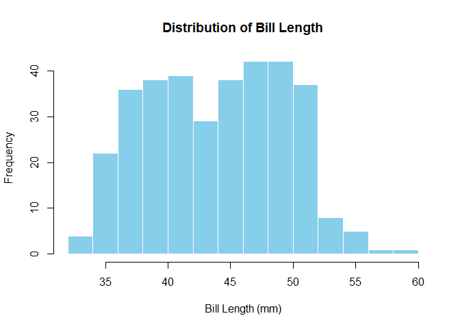
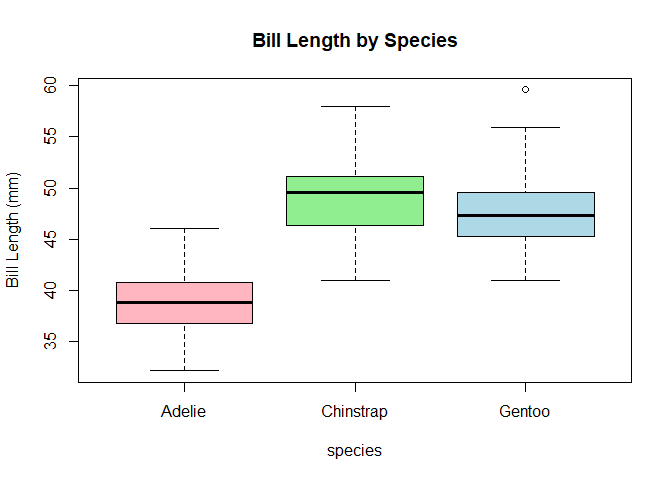
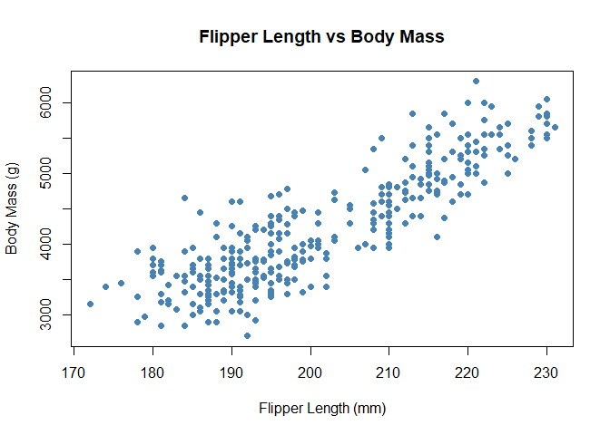
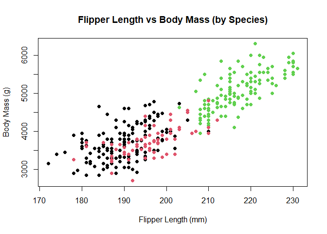

Module 3 — Visualisation
================

<!-- Dropdown for modules -->

<select id="module-select" class="course-dropdown" onchange="if (this.value) window.location.href=this.value;">
<option value="">Jump to a module…</option>
<option value="/r_for_nervous_humans/intro_stats/">Welcome</option>
<option value="/r_for_nervous_humans/intro_stats/module-1/">1. Getting
Started</option>
<option value="/r_for_nervous_humans/intro_stats/module-2/">2. Data &
Penguins</option>
<option value="/r_for_nervous_humans/intro_stats/module-4/">4.
Descriptive Statistics</option>
<option value="/r_for_nervous_humans/intro_stats/module-5/">5. Are These
Groups Different?</option>
<option value="/r_for_nervous_humans/intro_stats/module-6/">6. Working
with Categories</option>
<option value="/r_for_nervous_humans/intro_stats/module-7/">7. When Data
Gets Weird</option>
<option value="/r_for_nervous_humans/intro_stats/module-8/">8.
Relationships Between Variables</option>
<option value="/r_for_nervous_humans/intro_stats/module-9/">9. Linear
Regression</option> </select>

### Welcome to Module 3

So far, we’ve looked *at* data. Now we’re going to start *seeing* it.

Numbers on their own are hard to interpret. A column of 300 values
doesn’t naturally tell you a story. But a simple plot often does.
Visualisation is often the fastest way to understand what’s going on.
Before you start running tests or calculating anything complicated, a
good plot can tell you:

Before we calculate anything complicated, it’s usually worth asking:

- Are values spread out or tightly grouped?  
- Are groups different?  
- Do two variables move together?

Plotting data helps you answer questions like these.

By the end of this module, you will be able to:

- Create scatterplots, histograms, and boxplots  
- Understand what each type of plot shows  
- Begin spotting patterns in data

------------------------------------------------------------------------

### Histograms, or, ‘what does this variable look like?’

A histogram shows how values are distributed.

``` r
hist(penguins$bill_length_mm,
     main = "Distribution of Bill Length",
     xlab = "Bill Length (mm)",
     col = "skyblue",
     border = "white")
```

<!-- -->

What to look for: \* Where are most values? \* Is the distribution
symmetrical or skewed (i.e., larger on one side than the other)? \* Are
there any unusual values?

### Boxplots — comparing groups

Boxplots are useful when you want to compare groups.

``` r
boxplot(bill_length_mm ~ species,
        data = penguins,
        main = "Bill Length by Species",
        ylab = "Bill Length (mm)",
        col = c("lightpink","lightgreen","lightblue"))
```

<!-- -->

Each box represents one group (here, a species of penguin). Things to
look for:

- The middle line (median): where is the centre of each group?
- The height of the box: how spread out are the values?
- Any points outside the lines: potential outliers

At this stage, don’t worry about whether differences are “significant”.
Just ask whether groups look different.

### Scatterplots — relationships between variables

Scatterplots show the relationship between two variables. Each point is
one observation (one penguin, in this case).

Here, we’re asking: “As one variable changes, what happens to the
other?”

``` r
plot(penguins$flipper_length_mm,
     penguins$body_mass_g,
     main = "Flipper Length vs Body Mass",
     xlab = "Flipper Length (mm)",
     ylab = "Body Mass (g)",
     pch = 19,
     col = "steelblue")
```

<!-- -->

Look for: \* An upward trend → as one increases, so does the other \* A
downward trend → one increases while the other decreases \* No clear
pattern → the variables might not be related

You’re not calculating anything yet — just noticing patterns.

------------------------------------------------------------------------

### Adding colour (optional but useful)

Sometimes patterns aren’t obvious until you add a bit more information.
`species` is already a factor (a categorical variable), which is great
for analysis. When we produce basic plot, however, R needs **numbers to
map to colours**, not category names (this changes with more advanced
plotting packages but more on that, later). We convert the factor into
numbers using `as.numeric()`, which lets R assign a different colour to
each group:

``` r
cols <- as.numeric(penguins$species)

plot(penguins$flipper_length_mm,
     penguins$body_mass_g,
     col = cols,
     pch = 19,
     xlab = "Flipper Length (mm)",
     ylab = "Body Mass (g)",
     main = "Flipper Length vs Body Mass (by Species)")
```

<!-- -->

Now the plot tells a richer story. Instead of one cloud of points, you
may start to see clusters. Intelligent use of colour can reveal patterns
in the data.

### Why this matters

Plots are not just for presentation — they’re an important part of
thinking about data. Plots help you:

- Understand your data before analysing it  
- Spot patterns and relationships  
- Catch problems early (like outliers or strange values)

Before doing any statistical test, it’s good practice to Look at your
data *before* you test it.

------------------------------------------------------------------------

### Lessons learned

- Histograms show distributions
- Boxplots compare groups
- Scatterplots show relationships \*Visualisation helps you understand
  data before analysing it

<div style="margin-top: 2rem; display: flex; justify-content: space-between;">

<a href="/r_for_nervous_humans/intro_stats/module-2/" 
     style="padding: 0.6rem 1.2rem; 
            background-color: var(--theme-accent); 
            color: var(--theme-fg); 
            text-decoration: none; 
            border-radius: 6px;"> ← Previous </a>

<a href="/r_for_nervous_humans/intro_stats/module-4/" 
     style="padding: 0.6rem 1.2rem; 
            background-color: var(--theme-accent); 
            color: var(--theme-fg); 
            text-decoration: none; 
            border-radius: 6px;"> Next → </a>

</div>
