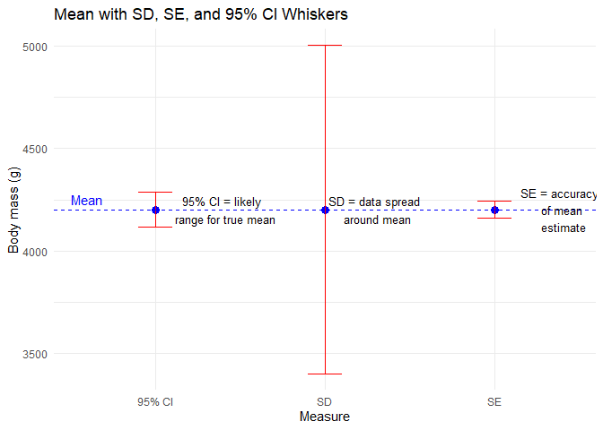
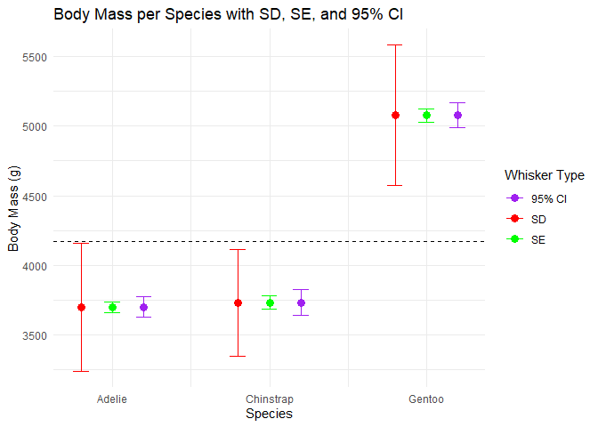

Module 4 — Descriptive Statistics
================

<!-- Dropdown -->

<select id="module-select" class="course-dropdown" onchange="if (this.value) window.location.href=this.value;">
<option value="">Jump to a module…</option>
<option value="/r_for_nervous_humans/intro_stats/">Welcome</option>
<option value="/r_for_nervous_humans/intro_stats/module-1/">1. Getting
Started</option>
<option value="/r_for_nervous_humans/intro_stats/module-2/">2. Data &
Penguins</option>
<option value="/r_for_nervous_humans/intro_stats/module-3/">3.
Visualisation</option>
<option value="/r_for_nervous_humans/intro_stats/module-5/">5. Are These
Groups Different?</option>
<option value="/r_for_nervous_humans/intro_stats/module-6/">6. Working
with Categories</option>
<option value="/r_for_nervous_humans/intro_stats/module-7/">7. When Data
Gets Weird</option>
<option value="/r_for_nervous_humans/intro_stats/module-8/">8.
Relationships Between Variables</option>
<option value="/r_for_nervous_humans/intro_stats/module-9/">9. Linear
Regression</option> </select>

## Welcome to module 4

Now that we can look at penguin data and visualise them, it’s time to
*summarise* our data numerically.  
Descriptive statistics help us answer questions like:

- What’s a “typical” value?  
- How much do values vary (differ)?  
- How confident are we about the average value of our sample? Does it
  accurately reflect the population?

Think of this as learning the language of the data before asking bigger
questions.

------------------------------------------------------------------------

## Prepare your dataset

Notice that we’re now using an additional package, `ggplot2`. This
supports more sophisticated plots and makes it easier to construct
high-quality figures.

``` r
library(palmerpenguins)
library(ggplot2)

data("penguins")

# Remove only the missing values for columns we need
penguins_clean <- penguins[!is.na(penguins$bill_length_mm) & 
                            !is.na(penguins$species) &
                            !is.na(penguins$body_mass_g), ]
```

Here, the square brackets mean ‘look inside this thing’. Square brackets
support indexing with rows separated from columns by a comma. So:

``` r
penguins_clean[1,]
```

    ## # A tibble: 1 × 8
    ##   species island    bill_length_mm bill_depth_mm flipper_length_mm body_mass_g sex    year
    ##   <fct>   <fct>              <dbl>         <dbl>             <int>       <int> <fct> <int>
    ## 1 Adelie  Torgersen           39.1          18.7               181        3750 male   2007

…gives you row 1. Similarly,

``` r
penguins_clean[,1]
```

    ## # A tibble: 342 × 1
    ##    species
    ##    <fct>  
    ##  1 Adelie 
    ##  2 Adelie 
    ##  3 Adelie 
    ##  4 Adelie 
    ##  5 Adelie 
    ##  6 Adelie 
    ##  7 Adelie 
    ##  8 Adelie 
    ##  9 Adelie 
    ## 10 Adelie 
    ## # ℹ 332 more rows

…gives you column one. And,

``` r
penguins_clean[1,1]
```

    ## # A tibble: 1 × 1
    ##   species
    ##   <fct>  
    ## 1 Adelie

…gives you the cell found at row 1, column 1. You can use more
complicated arguments to extract multiple values using an array argument
`:` for concurrent data or `c()` for non-concurrent data. If that sounds
like complete gibberish:

``` r
penguins_clean[,2:5]
```

    ## # A tibble: 342 × 4
    ##    island    bill_length_mm bill_depth_mm flipper_length_mm
    ##    <fct>              <dbl>         <dbl>             <int>
    ##  1 Torgersen           39.1          18.7               181
    ##  2 Torgersen           39.5          17.4               186
    ##  3 Torgersen           40.3          18                 195
    ##  4 Torgersen           36.7          19.3               193
    ##  5 Torgersen           39.3          20.6               190
    ##  6 Torgersen           38.9          17.8               181
    ##  7 Torgersen           39.2          19.6               195
    ##  8 Torgersen           34.1          18.1               193
    ##  9 Torgersen           42            20.2               190
    ## 10 Torgersen           37.8          17.1               186
    ## # ℹ 332 more rows

``` r
penguins_clean[,c(2,5)]
```

    ## # A tibble: 342 × 2
    ##    island    flipper_length_mm
    ##    <fct>                 <int>
    ##  1 Torgersen               181
    ##  2 Torgersen               186
    ##  3 Torgersen               195
    ##  4 Torgersen               193
    ##  5 Torgersen               190
    ##  6 Torgersen               181
    ##  7 Torgersen               195
    ##  8 Torgersen               193
    ##  9 Torgersen               190
    ## 10 Torgersen               186
    ## # ℹ 332 more rows

The first argument returns all of columns 1 to 5. The second only
returns columns 2 and 5.

``` r
penguins_clean <- penguins[!is.na(penguins$bill_length_mm) & 
                            !is.na(penguins$species) &
                            !is.na(penguins$body_mass_g), ]
```

So here we’re looking within `penguins` and excluding rows (using
`!is.na()`) where there are NAs in the columns `bill_length_mm`,
‘species’, and ’body_mass_g\`. We are *not* selecting so are including
them all.

------------------------------------------------------------------------

### Measures of central tendency

**Mean** — the “typical” value

``` r
mean(penguins_clean$bill_length_mm)
```

    ## [1] 43.92193

The mean is the foundation for most statistical tests like t-tests and
regression. It has mathematical properties that make differences and
variation easy to compute. Later, we’ll build everything from this
anchor.

**Median** — the middle value

``` r
median(penguins_clean$bill_length_mm)
```

    ## [1] 44.45

The median is the value in the middle of the sorted data. Unlike the
mean, it’s robust to extreme values.

------------------------------------------------------------------------

### Spread — how much the data varies

**Standard deviation (SD)**

``` r
sd(penguins_clean$bill_length_mm)
```

    ## [1] 5.459584

The Standard Deviation: \* Shows the typical distance of a given data
point from the mean (i.e., the spread of the data) \* Small SD = tightly
clustered; large SD = spread out.

**Standard error (SE)**

``` r
se <- sd(penguins_clean$bill_length_mm) / sqrt(length(penguins_clean$bill_length_mm))
se
```

    ## [1] 0.2952205

The Standard Error is computed by dividing the SD by the square root of
the number of measurements in the sample. It shows us how accurately we
can estimate the true average of the whole population based on our
sample. \* Smaller SE = more confidence in the mean (i.e., our sample
mean is close(r) to the population mean)

**95% confidence interval (CI)**

``` r
mean_val <- mean(penguins_clean$bill_length_mm)
ci_lower <- mean_val - 1.96 * se
ci_upper <- mean_val + 1.96 * se
c(ci_lower, ci_upper)
```

    ## [1] 43.34330 44.50056

The CI gives a plausible range for the true population mean. We
typically use the 95% threshold as this corresponds with our statistical
probability threshold of p = 0.05. It basically indicates that if we
repeated the study many times, around 95% of all calculated intervals
would contain the true mean.

------------------------------------------------------------------------

### When to use SD, SE, CI

| Measure | What it tells you     | When to use               |
|---------|-----------------------|---------------------------|
| SD      | Spread of raw data    | Understanding variability |
| SE      | Precision of the mean | Comparing sample means    |
| 95% CI  | Range of true mean    | Reporting uncertainty     |

### Visual comparison

The code below may seem daunting but we’ll cover `ggplot` in more detail
later. For now, just notice the way in which plots can be built in this
system by adding elements and using consistent language.

``` r
set.seed(123)
x <- rnorm(30, mean = 40, sd = 5)

mean_x <- mean(penguins_clean$body_mass_g)
sd_x <- sd(penguins_clean$body_mass_g)
se_x <- sd_x / sqrt(length(penguins_clean$body_mass_g))
ci_x <- c(mean_x - 1.96*se_x, mean_x + 1.96*se_x)


# Create a data frame for plotting whiskers
plot_df <- data.frame(
  measure = c("SD", "SE", "95% CI"),
  lower = c(mean_x - sd_x, mean_x - se_x, ci_x[1]),
  upper = c(mean_x + sd_x, mean_x + se_x, ci_x[2])
)

# Plot
ggplot(plot_df, aes(x = measure)) +
  geom_point(aes(y = mean_x), size = 3, color = "blue") +          # Mean as point
  geom_errorbar(aes(ymin = lower, ymax = upper), width = 0.2, color = "red") +
  labs(title = "Mean with SD, SE, and 95% CI Whiskers",
       y = "Body mass (g)", x = "Measure") +
  theme_minimal() +
  geom_hline(yintercept = mean_x, linetype = "dashed", color = "blue") +
    # Annotations
  annotate("text", x = 2.3, y = mean_x[1], 
           label = "SD = data spread \n around mean", color = "black", size = 3.5, hjust = 0.5) +
  annotate("text", x = 3.4, y = mean_x[1], 
           label = "SE = accuracy \n of mean \n estimate", color = "black", size = 3.5, hjust = 0.5) +
  annotate("text", x = 1.4, y = mean_x[1], 
           label = "95% CI = likely \n range for true mean", color = "black", size = 3.5, hjust = 0.5) +
  
  annotate("text", x = 0.5, y = mean_x + 50, label = "Mean", color = "blue", hjust = 0)
```

<!-- -->

You’ll notice that these estimates are for all penguins. This might be
an issue…

### Summarising by species

Before we start comparing penguins’ measurements statistically, it helps
to look at each group separately. Why? Because treating all penguins as
one giant lump ignores the fact that there may be important differences
between species.

Summarising by group lets us see patterns and differences visually and
numerically, which is exactly what statisticians do before running
formal tests.

Let’s calculate the mean bill length for each species:

``` r
tapply(penguins_clean$bill_length_mm,
       penguins_clean$species,
       function(x) mean(x, na.rm = TRUE))
```

    ##    Adelie Chinstrap    Gentoo 
    ##  38.79139  48.83382  47.50488

What’s happening here: 1. `tapply()` splits the data into groups — here,
by species. 2. The anonymous function
`function(x) mean(x, na.rm = TRUE)` calculates the mean of each group,
ignoring missing values. 3. The result is a small summary table showing
average bill length per species.

You can also summarise multiple statistics at once:

``` r
aggregate(bill_length_mm ~ species, data = penguins_clean, 
          FUN = function(x) c(mean = mean(x), sd = sd(x), n = length(x)))
```

    ##     species bill_length_mm.mean bill_length_mm.sd bill_length_mm.n
    ## 1    Adelie           38.791391          2.663405       151.000000
    ## 2 Chinstrap           48.833824          3.339256        68.000000
    ## 3    Gentoo           47.504878          3.081857       123.000000

Now we get the mean and SD for bill length and sample size per species
in one glance. This gives a preview of what later t-tests or ANOVAs will
formally test.

Let’s adjust that plot from earlier…

<!-- -->

### Intuition check:

- Compare the means across species: are they very different?
- Look at the SDs: which species’ measurements are more variable?
- Notice the sample size: smaller groups give less precise estimates
  (we’ll see this in SE and CI).

By summarising by species, we’re building a clear picture of the data
landscape. Later, when we run statistical tests, we’ll already have a
solid understanding of our data.

### Lessons learned

- Mean is central for later tests
- Median shows the middle value
- SD measures spread of data
- SE measures precision of the mean
- 95% CI gives a plausible range for the true mean
- Plotting these together helps visualize differences
- Always summarise groups separately before testing

<div style="margin-top: 2rem; display: flex; justify-content: space-between;">

<a href="/r_for_nervous_humans/intro_stats/module-3/" 
     style="padding: 0.6rem 1.2rem; 
            background-color: var(--theme-accent); 
            color: var(--theme-fg); 
            text-decoration: none; 
            border-radius: 6px;"> ← Previous </a>

<a href="/r_for_nervous_humans/intro_stats/module-5/" 
     style="padding: 0.6rem 1.2rem; 
            background-color: var(--theme-accent); 
            color: var(--theme-fg); 
            text-decoration: none; 
            border-radius: 6px;"> Next → </a>

</div>
