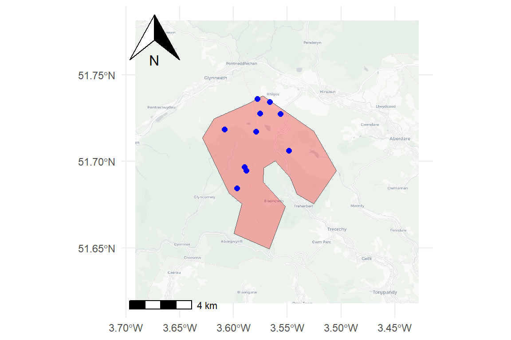

## Overview

This document demonstrates how to generate random sampling points within a polygon while enforcing a minimum distance between points using a Simple Sequential Inhibition (SSI) process.

## Libraries

```{r message=FALSE, warning=FALSE}
library(sf)
library(spatstat.geom)
library(spatstat.random)
library(dplyr)
library(ggplot2)
library(maptiles)
library(ggspatial)
library(units)
```

We load:

- `sf` for modern spatial data handling
- `spatstat` modules for generating spatial point patterns
- `ggplot2` for plotting
- `maptiles` and `ggspatial` for modern basemaps and map annotations
- `units` to safely handle distance units (e.g. metres)

First, create a bounding polygon using longitude and latitude coordinates in the WGS84 coordinate system. While this format is convenient for defining locations, it is not suitable for measuring distances because the units are in degrees rather than metres. To address this, the polygon is reprojected into the British National Grid coordinate system (EPSG:27700), which uses metres as its unit. This transformation is essential for ensuring that the minimum distance constraint applied later is accurate and interpretable. You can of course use our own shapefile if  you don't want to manually create a bounding polygon.

`spatstat` uses its own internal representation of space called an “observation window” (owin). We convert the `sf` polygon into owin format so it can be used as the boundary within which points will be generated. Without this conversion, the simulation functions in `spatstat` would not recognise the study area.

```{r}
x <- c(-3.541238, -3.547341, -3.561397, -3.572132, -3.572495, -3.551687,
       -3.566528, -3.599789, -3.592162, -3.604156, -3.629145, -3.618190,
       -3.585571, -3.572779, -3.525398, -3.504483, -3.525454, -3.541238)

y <- c(51.68106, 51.69050, 51.7003, 51.69617, 51.68800, 51.67405,
       51.64949, 51.65832, 51.67560, 51.68177, 51.71373, 51.72463,
       51.73346, 51.73788, 51.71745, 51.69461, 51.67548, 51.68106)

# Create sf polygon in WGS84
poly_wgs <- st_polygon(list(cbind(x, y))) |> 
  st_sfc(crs = 4326)

# Transform to British National Grid (meters)
poly <- st_transform(poly_wgs, 27700)

win <- as.owin(poly)
```

Points are generated using the Simple Sequential Inhibition (SSI) process, which places points randomly but rejects any candidate point that falls within a specified distance of an existing point. In this case, the inhibition distance is set to 250 metres. The result is initially returned as a ppp object (a `spatstat` point pattern), which is then converted into an `sf` object for compatibility with the rest of the workflow.

```{r}
samp1_ppp <- rSSI(r = 250, n = 10, win = win)  # 250 meters

# Convert to sf
samp1 <- st_as_sf(as.data.frame(samp1_ppp), coords = c("x", "y"), crs = 27700)
```

We then generate a full matrix of pairwise distances between all generated points. Inspecting this matrix provides a direct way to verify that the minimum distance constraint has been respected across all points.

```{r}
dist_matrix <- st_distance(samp1)
dist_matrix
```

To summarise the spacing between points, the minimum non-zero distance for each point is extracted from the distance matrix. This represents the distance from each point to its nearest neighbour. The resulting values are added back to the spatial dataset as a new attribute (min_dist_m), providing a convenient way to assess how close each point is to its closest neighbour.

```{r}
nearest <- apply(dist_matrix, 1, function(v) min(v[v > 0]))

samp1 <- samp1 |> 
  mutate(min_dist_m = as.numeric(set_units(nearest, "m")))
```

Web-based map tiles are typically served in geographic coordinates (WGS84), so the polygon is temporarily transformed back into that coordinate system for tile retrieval. The `maptiles` package is used to download a clean basemap from the CartoDB Positron provider, which is well suited for analytical visualisations due to its minimal styling.

The final map combines the basemap tiles with the study polygon and sampled points. Additional cartographic elements such as a scale bar and north arrow are added using `ggspatial.` 

```{r points_by_min_distance, fig.path='../../static/img/', fig.width=6, fig.height=4, eval = FALSE}
# Transform back to WGS84 for tile download
poly_wgs <- st_transform(poly, 4326)

tiles <- get_tiles(poly_wgs, provider = "CartoDB.Positron", zoom = 12)

# Plot 
ggplot() +
  layer_spatial(tiles) +
  geom_sf(data = poly, fill = "red", alpha = 0.3) +
  geom_sf(data = samp1, color = "blue", size = 2) +
  annotation_scale(location = "bl") +
  annotation_north_arrow(location = "tl", which_north = "true") +
  theme_minimal()
```

```{r, echo=FALSE, out.width="70%"}

```

This function encapsulates the full workflow into a reusable tool. It takes a polygon, a minimum distance, and a desired number of points as inputs, then generates a spatial point dataset that satisfies the distance constraint. It also computes and attaches the nearest neighbour distance for each point. 

```{r eval = FALSE}
# Function to generate random points within a polygon buffered by a minimum distance
# Attaches a dataframe of distances-between-points
#
# d = inherited distance (see rSSI documentation)
# n = number of points
# p = polygon
#
# E.g.
# spat <- Rpoints(d = 0.05, n = 50, p = poly1)
Rpoints <- function(d = 250, n = 10, p){
  
  stopifnot(inherits(p, "sf"))
  
  # Ensure projected CRS (meters)
  if (st_is_longlat(p)) {
    stop("Polygon must be projected (e.g., EPSG:27700)")
  }
  
  win <- as.owin(p)
  
  pts_ppp <- rSSI(r = d, n = n, win = win)
  
  pts <- st_as_sf(as.data.frame(pts_ppp), coords = c("x", "y"), crs = st_crs(p))
  
  dist_matrix <- st_distance(pts)
  
  nearest <- apply(dist_matrix, 1, function(v) min(v[v > 0]))
  
  pts |> 
    mutate(min_dist_m = as.numeric(set_units(nearest, "m")))
}

# Example usage
spat <- Rpoints(d = 200, n = 30, p = poly)
head(spat)
```